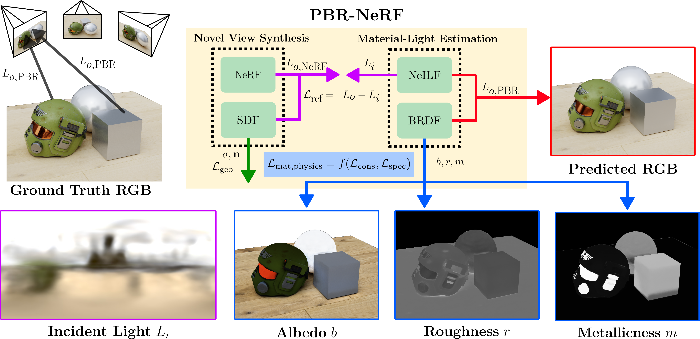
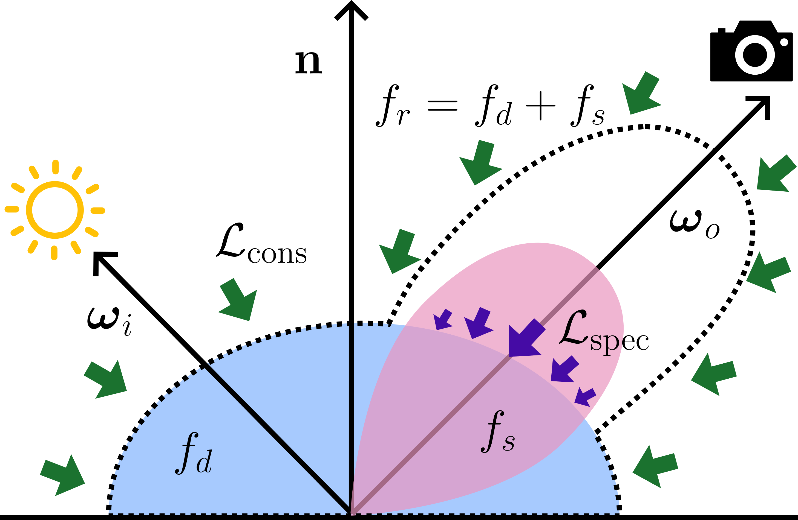

# PBR-NeRF: Inverse Rendering with Physics-Based Neural Fields

This software project accompanies the research paper, PBR-NeRF: Inverse Rendering with Physics-Based Neural Fields and can be used to reproduce the results in the paper.

<p align="center">
  
</p>

## Introduction 
PBR-NeRF is a differentiable rendering framework for joint geometry, material and lighting estimation from multi-view images.
We build upon [NeILF++](https://arxiv.org/abs/2303.17147) and introduce two novel physics-based losses: (1) the Conservation of Energy Loss and (2) the NDF-weighted Specular Loss.

Our novel losses represent two intuitive priors that we use to achieve state-of-the-art material estimation without compromising novel view synthesis quality. 
Please see `code/model/loss.py` for the exact loss implementation.
<p align="center">
  
</p>

## Reproducing Experiments
We provide the following scripts to reproduce key results in the paper.
The environment setup is described in the following section.

Note that the final evaluation results are stored in:
```commandline
pbrnerf/code/outputs/joint/<run>/evaluation/report_evaluation.json
```

### PBR-NeRF
Our full proposed method can be run on the NeILF++ and DTU dataset using the following scripts.
We provide additional helper scripts to run the full method on all dataset scenes to reproduce experiments.

#### NeILF++ Dataset
```commandline
sbatch train_pbrnerf_neilfpp.sh
```

#### DTU Dataset
```commandline
sbatch train_pbrnerf_dtu.sh
```

### SOTA Experiments
Run the following scripts to reproduce the SOTA experiments on the NeILF++ and DTU datasets.

#### NeILF++ Dataset
```commandline
./sota_neilfpp.sh
```

#### DTU Dataset
```commandline
./sota_dtu.sh
```

### Ablation study
Run the following script to reproduce the ablation study on the NeILF++ City scene.
```commandline
./ablation_pbr_losses.sh
```

## Getting Started

### Environment Setup
We provide two options for environment setup
1. `pip`
2. `conda`

#### Pip
1. Update `setup_pip.sh` with your correct local paths (if needed). Verify that all paths (e.g. `OptiX_INSTALL_DIR` and `LD_LIBRARY_PATH`) in `setup_pip.sh` are set up correctly


2. Install [NVIDIA optix 7.3 for Linux](https://developer.nvidia.com/designworks/optix/downloads/legacy) using your NVIDIA account.
   You may want to change the install prefix below to your own local machine's scratch directory.

```commandline
sh NVIDIA-OptiX-SDK-7.3.0-linux64-x86_64.sh --include-subdir --skip-license
```

3. Run `setup.sh`. This should take around 60 mins to run.

```commandline
sbatch setup_pip.sh
```

4. Log into `wandb` and paste your API key when prompted

```commandline
mamba activate neilfpp2080
wandb login
```

#### Conda
Install `mamba` for a faster `conda` alternative
```commandline
conda install mamba -n base -c conda-forge
```

1. Update `setup_conda.sh` with your `conda` and `mamba` paths (if needed). This is only required if you store your `conda`
   and `mamba` paths differently than expected by the script

2. Install [NVIDIA optix 7.3 for Linux](https://developer.nvidia.com/designworks/optix/downloads/legacy) using your NVIDIA account.
   You may want to change the install prefix below to your own local machine's scratch directory.

```commandline
sh NVIDIA-OptiX-SDK-7.3.0-linux64-x86_64.sh --include-subdir --skip-license
```

3. Verify that all other paths (e.g. `OptiX_INSTALL_DIR` and `LD_LIBRARY_PATH`) in `setup_conda.sh` are set up correctly

4. Run `setup_conda.sh`. This should take around 60 mins to run.

```commandline
./setup_conda.sh
```

5. Log into `wandb` and paste your API key when prompted

```commandline
mamba activate neilfpp2080
wandb login
```

### Dataset Setup
Download the synthetic dataset, the preprocessed DTU dataset and the HDR dataset from the [original NeILF++ dataset source](https://apple.box.com/s/2ulz3kjtca53aj3qlwjwyv27zfuug2x5). Note that for the synthetic dataset, all scenes shares the same geometry files and the BRDF ground truths. We only provide the geometry files and the BRDF GT in `synthetic_city`, and users may structure the input of another scene by substituting the image folder (`synthetic_city/inputs/images`) to another input image folder.

Extract the synthetic dataset to `~/scratch/datasets/neilfpp_synthetic`. Your directories should look like this:
```commandline
$ tree -L 1 ~/scratch/datasets/neilfpp_synthetic/
/home/user/scratch/datasets/neilfpp_synthetic/
├── synthetic_castel
├── synthetic_castel_mix
├── synthetic_city
├── synthetic_city_mix
├── synthetic_studio
└── synthetic_studio_mix

6 directories, 0 files
```

## File Formats

Input data should be structured into the following:
```
.                          
├── inputs      
│   ├── images
│   ├── position_maps (optional)
│   ├── depth_maps (optional)
│   ├── normal_maps (optional)
│   ├── model (optional)
│   │   ├── components of a textured mesh (synthetic dataset)
│   │   └── oriented_pcd.ply (other datasets)
│   └── sfm_scene.json   
│      
└── ground_truths (optional)
    └── materials 
        ├── kd
        ├── roughness
        └── metallic       
```
### Camera Input
The `sfm_scene.json` file is used to stored the metadata and the SfM result of a scene. Please refer to `load_cams_from_sfmscene` in `utilts/io.py` for details.
* Camera intrinsics are stored in `sfm_scene['camera_track_map']['images']['INDEX']['intrinsic']`
* Camera extrinsics are stored in `sfm_scene['camera_track_map']['images']['INDEX']['extrinsic']`
* Image list are stored in `sfm_scene['image_list']['file_paths']`. (image index -> image path)
* The bounding box transformation is stored in `sfm_scene['bbox']['transform']`, which can transform the eight bounding box corners to normalized points at `{1/-1, 1/-1, 1/-1}`. It is used to compute the scale mat for coordinate normalization.
* Other fields could be ignored.

### Image Input
The image names should be stored in `sfm_scene['image_list']['file_paths']`. You can use `.jpg` and `.png` formats for LDR inputs, or `.exr` and `.tiff` formats for HDR inputs. 

### Geometry Input
Geometry input is required by the synthetic dataset. The geometry input should be provided as either the rendered position map at each view (in `inputs/position_maps`) or the rendered depth map at each view (in `inputs/depth_maps`). For other datasets, an oriented point cloud is preferred (in `inputs/model/oriented_pcd.ply`). 

### Texture Input (for BRDF Export)
The position atlas should be provided for exporting BRDF texture maps. (in `inputs/model/pos_tex`, see sample data for details)

## Acknowledgements
We sincerely thank the authors of [NeILF++](https://github.com/apple/ml-neilfpp) for publicly sharing their code and dataset, which served as the foundation of our work.
PBR-NeRF builds upon the NeILF++ framework and their contributions have been invaluable in enabling our research.

